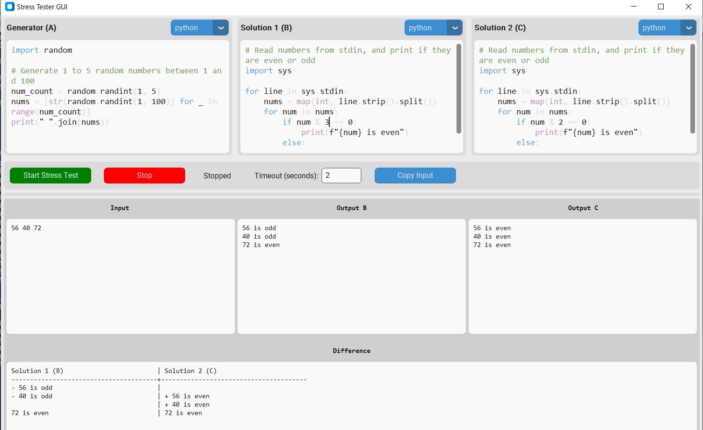

# Stress Tester GUI (ストレステスターGUI)

競技プログラミングの解答をストレステストするためのグラフィカルユーザーインターフェースです。

このツールは、ジェネレータスクリプトを使用して2つの異なる解答を互いにテストすることができます。一方の解答が失敗したり、異なる出力を生成したりするエッジケースを見つけるのに役立ちます。



## 主な機能

-   ジェネレータと2つの解答のための左右に並んだコードエディタ。
-   複数の言語をサポート: Python, C++, Java。
-   テスト速度を最大化するために、解答を並列で実行。
-   食い違いが見つかった場合に自動的に停止。
-   失敗したテストケース、両方の解答の出力、および左右に並んだ差分を表示。
-   コードと言語の設定を自動的に保存。
-   解答の実行タイムアウトを調整可能。

## インストール

1.  **リポジトリをクローンする:**
    ```bash
    git clone https://github.com/Maruoka842/stressTester.git
    cd stressTester
    ```

2.  **依存関係をインストールする:**
    このプロジェクトはPython 3を使用し、`customtkinter`が必要です。

    ```bash
    pip install -r requirements.txt
    ```

## 使い方

1.  **アプリケーションを実行する:**
    ```bash
    python main.py
    ```
    batファイルを準備しておくと便利です。

2.  **コードを記述する:**
    -   **ジェネレータ (A):** テストケースの入力を生成し、標準出力に出力するスクリプトを記述します。
    -   **解答1 (B):** あなたの最初の解答。標準入力から読み込み、結果を標準出力に出力します。
    -   **解答2 (C):** 比較対象のあなたの2番目の解答（または、参照用の全探索解など）。

3.  各エディタの上にあるドロップダウンメニューから、各スクリプトの**言語を選択**します。

4.  各テストケースごとに各解答が実行を許可される**タイムアウト**（秒単位）を設定します。

5.  **"Start Stress Test"をクリックします。**

    -   アプリケーションは継続的にテストケースを生成し、両方の解答を実行し、それらの出力を比較します。
    -   下部のログパネルに進捗が表示されます。
    -   解答Bと解答Cの出力が異なる場合、テストは停止し、問題を引き起こした入力、2つの異なる出力、およびハイライトされた差分がアプリケーションに表示されます。

6.  テストを手動で停止するには、**"Stop"をクリック**します。

## 動作の仕組み

1.  **ジェネレータ (A)** が実行され、ランダムなテストケースが生成されます。
2.  ジェネレータの標準出力が、**解答1 (B)** と **解答2 (C)** の両方の標準入力として渡されます。
3.  解答は別々のプロセスで並列に実行されます。
4.  アプリケーションは両方の解答の標準出力をキャプチャし比較します。
5.  一致しない場合、テストは停止し、結果が表示されます。
6.  このプロセスは、食い違いが見つかるか、ユーザーがテストを停止するまで繰り返されます。
